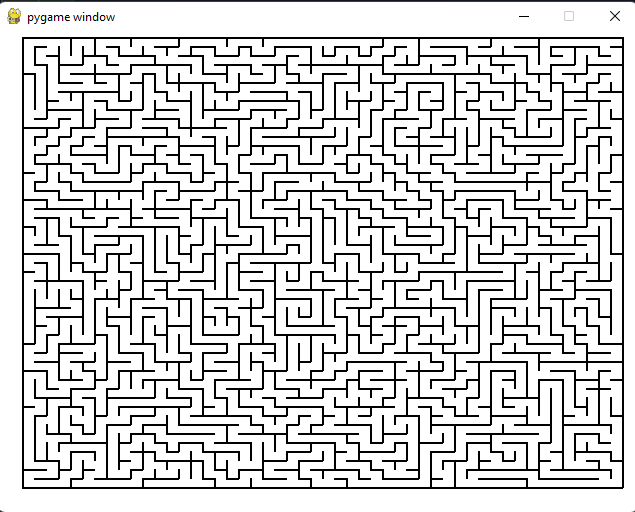

# Maze generator using pygame

Funny little program to generate maze using pygame 
and a great exercise to practice some algorithms.
I've used Iterative DFS to generate the maze.



## Before running
You need to install pygame via pip
### Run the following to install pygame

```bash
pip install pygame
```

## Running the application 
Run the following to run the application 
```bash
python3 maze_generator.py
```